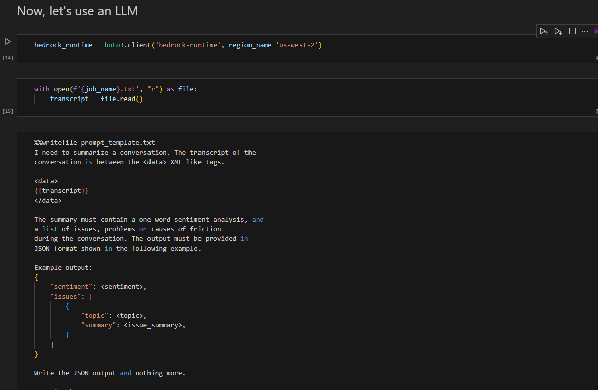
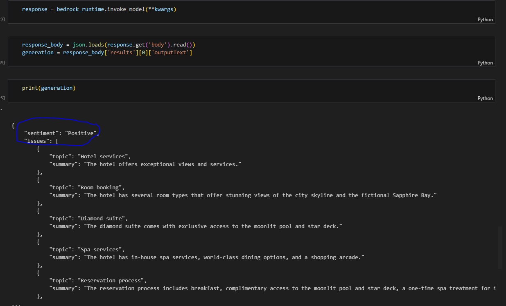

# AWS-Bedrock-LLMServerlessApp
LLM app using AWS Bedrock ( credits : [www.learn.deeplearning.ai](https://www.deeplearning.ai/))
## POC Overview And High Level Design

- Below is the high-level Work flow /Architecture of a LLM app levaraging AWS-Bedrockto to solve a common problem of customer service department in handling a customer issue with their compnay's product or service.
       

1. Create a base LLM app which uses jupitor notebook and AWS Bedrock to generate a  response for a given "prompt".
2. Use a sample audio file , transcribe using AWS transcribe service and feed it to bedrock for sentiment analysis/prompt engineering.
    - In this case summarize the call
    - Determine if there is any problem
    - Over all sentiment of the call ( Positive vs negative )

### Overview of the code:
1. Lets solve a try a basic prompt using below where in creating a instance of of AWS Bedrock runtime and running the code for a sample prompt.

prompt Response

2. Here we are loading a sample audio file (which has customer conversation with rep) and load it into AWS S3 and transcribe using AWS Transcribe

3.Here above text response(used as prompts) from audio will be fed to Bedrock runtime.

4.For a given expected promt structure below is the response . ofcourse this structure needs to be tuned for specific problem / industry.

#### Below AWS services  were used
- AWS Lambda ( serverless)
- S3
- Bedrock
- AWS transcribe service

Note: This code under src can be run using Jupyter python notebook.